A Pokemon MMO

## Directory Guide  

### [Assets](assets) contains all the assets used in the game. 
The directories are organized by the Pokemon's National Dex number.  
For example, Bulbasaur's National Dex number is 1, so all of Bulbasaur's assets are in the directory `assets/0001`.  

Each of these directories contain the following files:
| Name | File Prepend | Image |
| --- | --- | --- |
| Battle Sprite Back | `bsb_` | 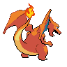 |
| Battle Sprite Front | `bsf_` | 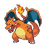 |
| Icon | `ic_` | 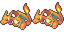 |
| Overworld Sprite | `ow_` | 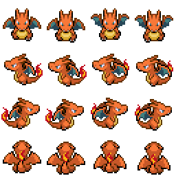 |

In addition, the directory could also contain shiny variants of the above files if applicable/available with the exception for icons:
| Name | File Prepend | Image |
| --- | --- | --- |
| Shiny Battle Sprite Back | `bsb_shiny` | 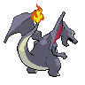 |
| Shiny Battle Sprite Front | `bsf_shiny` | 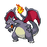 |
| Shiny Overworld Sprite | `ow_shiny` | 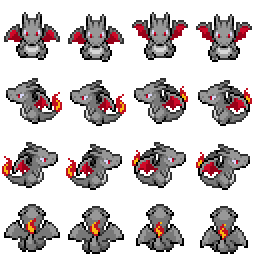 |

Lastly, the directory could contain most of the above but for different forms of the Pokemon. Take for example, Charizard's Gigantamax form:
| Name | File Prepend | Image |
| --- | --- | --- |
| Battle Sprite Back | `bsb_gigantamax` | 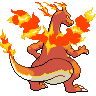 |
| Shiny Battle Sprite Back | `bsb_shiny_gigantamax` | 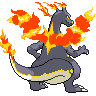 |
| Battle Sprite Front | `bsf_gigantamax` | 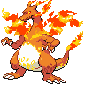 |
| Shiny Battle Sprite Front | `bsf_shiny_gigantamax` | 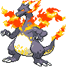 |
| Icon | `ic_gigantamax` | 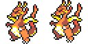 |

